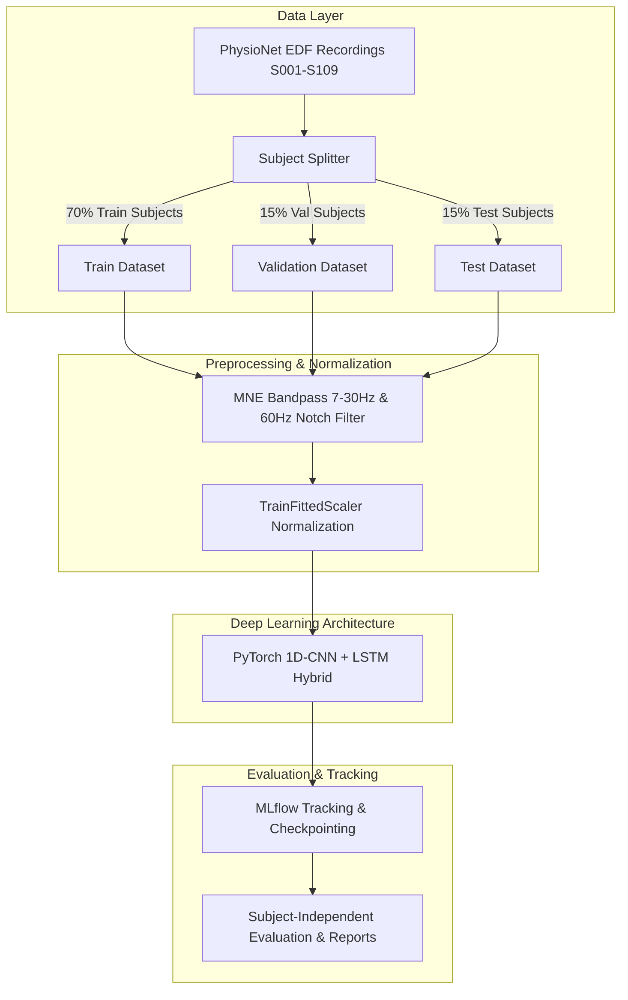

# Reproducible EEG Motor Imagery Classification Using CNN-LSTM Deep Learning

[](https://github.com/eeg-research/eeg-motor-imagery-classification/actions)
[](https://www.python.org/downloads/)
[](https://github.com/astral-sh/ruff)
[](LICENSE)

An open-source, production-grade research framework for **Subject-Independent EEG Motor Imagery Classification** using PyTorch, MNE-Python, and hybrid CNN-LSTM deep learning architectures applied to the **PhysioNet EEG Motor Movement/Imagery Dataset (v1.0.0)**.

---

## 1. Project Title
**Reproducible EEG Motor Imagery Classification Using CNN-LSTM Deep Learning** (`eeg-motor-imagery-classification`)

---

## 2. Project Status
> [!IMPORTANT]
> **Current status**: The software pipeline, tests, subject-independent splitting, preprocessing components, and model training components are implemented. The two-class real-EDF experiment is still being validated. Final accuracy claims have not yet been established.

---

## 3. Research Objective
Motor Imagery (MI) EEG signals are non-stationary, low SNR, and highly variable across human subjects. Standard random signal-window splitting leads to severe **subject-level data leakage** and falsely inflated performance claims. 

This project provides an open research framework that:
1. Evaluates models exclusively on **unseen test subjects** (Subject-Independent Classification).
2. Enforces strict **zero data leakage** by fitting normalization parameters (`TrainFittedScaler`) only on training subjects.
3. Implements 1D Convolutional Neural Networks (spatial-frequency feature extraction) combined with Recurrent LSTMs (temporal dependency modeling).

---

## 4. Important Disclaimer
- **Active Research Prototype**: This codebase is an active research software prototype.
- **Results Not Final**: Baseline and deep learning benchmarks on full multi-class tasks are under active validation.
- **No Automatic Paper Reproduction Claims**: Accuracy values reported in original literature are not assumed or claimed to be automatically reproduced without full experimental validation.

---

## 5. Project Architecture



---

## 6. Repository Structure
```text
eeg-motor-imagery-classification/
├── README.md                          # Research documentation
├── LICENSE                            # MIT License
├── CITATION.cff                       # Citation metadata
├── CONTRIBUTING.md                    # Developer guidelines
├── CODE_OF_CONDUCT.md                 # Community guidelines
├── SECURITY.md                        # Security policy
├── pyproject.toml                     # Python dependencies & tooling configs
├── Makefile                           # Development task runner
├── .gitignore                         # Strict exclusion rules (data, models, logs)
├── .env.example                       # Safe environment variable templates
├── docker/
│   └── Dockerfile                     # Docker container spec
├── .github/
│   └── workflows/                     # CI workflows
├── configs/                           # Hydra YAML configurations
├── data/
│   ├── raw/                           # Location for downloaded PhysioNet EDF files
│   ├── processed/                     # Preprocessed data arrays
│   └── splits/                        # Subject split manifest
├── scripts/                           # CLI pipeline scripts
├── src/
│   └── eeg_mi/                        # Core Python package
├── tests/                             # Unit and integration test suite
└── reports/                           # Evaluation output directory
```

---

## 7. Environment Setup
Requires **Python 3.11+**. Using `uv` or `venv` is recommended.

```bash
# Clone repository
git clone https://github.com/eeg-research/eeg-motor-imagery-classification.git
cd eeg-motor-imagery-classification

# Create virtual environment
python -m venv .venv
source .venv/bin/activate

# Install dependencies in editable mode
pip install -e ".[dev]"

# Verify installation
python scripts/check_environment.py
```

---

## 8. CPU-Only Setup Instructions
The framework operates seamlessly on standard CPU hardware without requiring an NVIDIA GPU or CUDA:
- Automatic selection: `torch.device("cuda" if torch.cuda.is_available() else "cpu")`
- CPU-safe defaults: `batch_size: 8`, `num_workers: 0`, `pin_memory: false`

```bash
# Force CPU execution explicitly
python scripts/train.py device=cpu batch_size=8 num_workers=0
```

---

## 9. Optional CUDA/GPU Instructions
If an NVIDIA GPU with CUDA is available, PyTorch will automatically utilize the GPU device:
```bash
python scripts/train.py device=cuda batch_size=32
```

---

## 10. PhysioNet Dataset Source
This project uses the **PhysioNet EEG Motor Movement/Imagery Dataset (v1.0.0)**:
- **DOI**: [10.13026/C28G6P](https://doi.org/10.13026/C28G6P)
- **URL**: [https://physionet.org/content/eegmmidb/1.0.0/](https://physionet.org/content/eegmmidb/1.0.0/)

---

## 11. Dataset Download Instructions
Raw EEG files must be downloaded manually using `wget` or `rsync`:

```bash
# Create target raw data directory
mkdir -p data/raw/physionet
cd data/raw/physionet

# Download complete dataset via wget (approx 1.2 GB)
wget -r -N -c -np https://physionet.org/files/eegmmidb/1.0.0/
```

---

## 12. Dataset Placement
Ensure raw EDF files are structured as follows:
```text
data/raw/physionet/
├── S001/
│   ├── S001R01.edf
│   ├── S001R02.edf
│   ├── S001R04.edf  (Motor Imagery Left vs Right Fist)
│   └── ...
├── S002/
└── S109/
```

---

## 13. Raw EEG Data Policy
> [!WARNING]
> Raw EEG recordings contain physiological biometric signals and large binary data files (`.edf`). **Raw EEG files must never be committed to Git or pushed to GitHub.** `.gitignore` strictly excludes `data/raw/` and `*.edf`.

---

## 14. Data Preprocessing
1. **Channel Selection**: Picks 64 EEG channels exclusively (`eeg=True`), discarding auxiliary non-EEG channels.
2. **Band-pass Filtering**: 7.0 Hz – 30.0 Hz FIR filter targeting Mu (8–12 Hz) and Beta (13–30 Hz) motor rhythms.
3. **Notch Filtering**: 60.0 Hz notch filter eliminating powerline interference.
4. **Window Segmentation**: Epochs segmented starting at event onset ($t_{\text{event}}$ to $t_{\text{event}} + 3.0\text{s}$).

---

## 15. Run-Specific Motor-Imagery Label Mapping
PhysioNet recordings feature run-specific task annotations. The 2-class motor imagery pipeline uses:
- **Runs 4, 8, 12 (Motor Imagery Left Fist vs Right Fist)**:
  - `T1` = Left Fist Motor Imagery $\to$ mapped to **`0`**
  - `T2` = Right Fist Motor Imagery $\to$ mapped to **`1`**
  - `T0` (Rest) events are explicitly ignored for the 2-class experiment.

---

## 16. Subject-Independent Train/Validation/Test Splitting
- **Train Split (70%)**: 76 subjects
- **Validation Split (15%)**: 16 subjects
- **Test Split (15%)**: 17 subjects
- Generated via `python scripts/create_subject_splits.py` and saved to `data/splits/subject_split.json`.

---

## 17. Data-Leakage Prevention
- **Disjoint Partitioning**: $S_{\text{train}} \cap S_{\text{val}} = \emptyset$, $S_{\text{train}} \cap S_{\text{test}} = \emptyset$.
- **Train-Fitted Scaler**: Z-score normalization parameters ($\mu, \sigma$) are computed strictly on training subjects (`TrainFittedScaler`).
- **No Mock Fallback in Production**: Training and evaluation pipelines raise a clear `FileNotFoundError` if raw EDF data is missing rather than generating fake random noise.

---

## 18. Baseline Model Usage
Train a Linear Discriminant Analysis (LDA) baseline model on PSD features:
```bash
python scripts/train.py --config-name=experiments/baseline.yaml
```

---

## 19. CNN-LSTM Model Usage
Train the hybrid CNN-LSTM deep learning architecture:
```bash
python scripts/train.py experiments=cnn_lstm
```

---

## 20. GAN Augmentation Status
Conditional GAN data augmentation (`src/eeg_mi/augmentation/gan.py`) is implemented as an optional module. It is **disabled by default** (`use_gan_augmentation: false`) pending full experimental validation.

---

## 21. Training Commands
```bash
# Generate subject split manifest
python scripts/create_subject_splits.py

# Train 2-class CNN-LSTM model for 30 epochs
python scripts/train.py experiments.training.epochs=30
```

---

## 22. Evaluation Commands
Evaluate trained checkpoint on separate test subjects:
```bash
python scripts/evaluate.py --checkpoint models/checkpoints/cnn_lstm_2class_best.pt
```
Outputs `metrics_summary.json`, `metrics_summary.csv`, and `confusion_matrix.png` to `reports/experiments/`.

---

## 23. Testing Commands
Run unit and integration test suite:
```bash
# Run tests with pytest
pytest tests/

# Run tests with coverage
pytest --cov=src/eeg_mi tests/
```

---

## 24. Reproducibility Instructions
1. Follow setup instructions to install dependencies in a clean virtual environment.
2. Download PhysioNet EDF files to `data/raw/physionet/`.
3. Run `python scripts/create_subject_splits.py` (seed 42).
4. Run `python scripts/train.py` and `python scripts/evaluate.py`.
5. Inspect logged parameters and metrics in MLflow (`sqlite:///mlruns.db`).

---

## 25. Known Limitations
- **Subject Variability**: Inter-subject variability across 109 subjects is high, requiring domain adaptation or fine-tuning for real-world deployment.
- **Channel Density**: PhysioNet uses 64 channels; consumer BCI headsets typically feature 8–16 channels.

---

## 26. Ethical & Privacy Considerations
- EEG signals contain physiological biometric data. Raw dataset files must never be redistributed outside PhysioNet's license terms.
- Models developed in this repository are for academic research and software architecture exploration only—not for clinical medical diagnosis.

---

## 27. Future Real-Time EEG Headset Integration
The streaming prediction CLI ([`scripts/predict.py`](scripts/predict.py)) accepts raw EEG window tensors `(64, 480)` for real-time BCI integration (e.g. Lab Streaming Layer - LSL).

---

## 28. Citation Instructions
If using this software in your research, please cite:

```bibtex
@article{schalk2004bci2000,
  title={BCI2000: a general-purpose brain-computer interface (BCI) system},
  author={Schalk, Gerwin and McFarland, Dennis J and Hinterberger, Thilo and Birbaumer, Niels and Wolpaw, Jonathan R},
  journal={IEEE Transactions on Biomedical Engineering},
  volume={51},
  number={6},
  pages={1034--1043},
  year={2004}
}
```

---

## 29. License
This project is licensed under the **MIT License**. See [`LICENSE`](LICENSE) for details.

---

## 30. Contribution Instructions
Contributions are welcome! Please read [`CONTRIBUTING.md`](CONTRIBUTING.md) and [`CODE_OF_CONDUCT.md`](CODE_OF_CONDUCT.md) before submitting pull requests.
